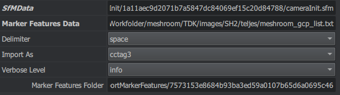
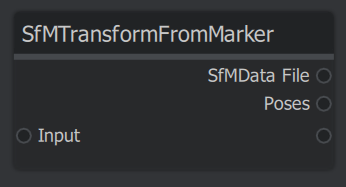
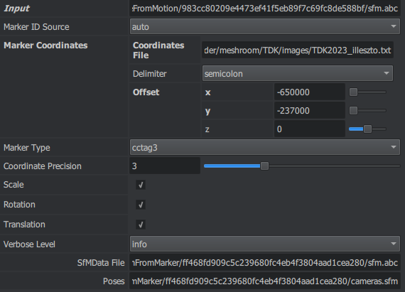

# MeshroomGCPMarkerAdditions

This repository contains custom processing nodes for the AliceVision Meshroom photogrammetry software. The work here is the result of a university study project examining the precision achievable in open source applications, and is aimed at improving the usability and automation of ground control points (GCP) in Meshroom. The custom nodes are based on the source code of the built-in nodes available in the repository of the [Meshroom](https://github.com/alicevision/Meshroom) project. Additional information was obtained from the repository of the [AliceVision](https://github.com/alicevision/AliceVision) framework.

# Installation

1. Download the repository as ZIP
2. Unzip it to a convenient place
3. Navigate to the directory of Meshroom
4. Navigate to the directory of the processing nodes
5. Copy the GCPMarkerAdditions folder into the nodes folder

The nodes folder is located at: `Meshroom\lib\meshroom\nodes`

# Usage

## ImportMarkerFeatures node


The built-in marker detection support in Meshroom is rather obviously an afterthought, and as such, not very realiable due to the lack of detection parameters. This node allows to import GCP marker data produced by sources outside Meshroom through a specifically formatted CSV file.

### Attributes



1. SfMData:

    Link to the SfMData output of the CameraInit node. 
    
    This `cameraInit.sfm` file is used to identify which images are used in the project, and what their assigned view IDs are.

2. Marker Features Data:

    Path to list file containing the marker image coordinates.

    The file extension itself does not matter, but the data has to be formatted CSV-like, with 5 different delimiter characters supported (space, tab, comma, colon, semicolon). Each line of the file defines the position of 1 marker on an image. The required fields are the following:

    ```
    markerX, markerY, imageFileName, markerID, markerSize

    markerX:            horizontal image coordinate of marker in pixels
    markerY:            vertical image coordinate of marker in pixels
    imageFileName:      name of image file including extension (case sensitive)
    markerID:           unique ID of marker
    markerSize:         size of marker in pixels
    ```

    Example for a space delimited input file:
    ```
    2323 2455 DSC04997.JPG 2 15.5081
    1040 2286 DSC04997.JPG 0 25.0200
    2321 1598 DSC05000.JPG 3 12.5000
    3329 1592 DSC05000.JPG 6 12.0000
    1938 1713 DSC05000.JPG 2 15.5000
    ```

    The node will only process marker positions that are located in images actually loaded into Meshroom, other lines will be discarded.

3. Delimiter

    Delimiter character used in the marker list file.

    Options are:
    - space
    - tab
    - comma
    - colon
    - semicolon

4. Import As

    Meshroom only supports 3 marker families by default: cctag3, cctag4 and the 16h5 AprilTag marker (with 16h5 only actually being supported on Linux). Since the cctag3 and 4 families are identified by a single point in the image, any arbitrary marker or other position can be represented with cctag feature describer files. The node can generate cctag3 or cctag4 feature describers from the provided marker data, depending on the needs. Both cctag3 and cctag4 decriptions support marker IDs from 0 to 127.

### Outputs

1. Marker Features Folder

    The marker feature describer files generated from the supplied data will be placed in this folder. This folder can then be added to the Features Folders input of the FeatureMatching node. (The desired marker family feature type - cctag3 or cctag4 - has to be manually enabled in the FeatureMatching node!!!)

## SfMTransformFromMarkers node



The SfMTransform node included in Meshroom can be used to georeference the sparse point cloud based on markers, but the marker coordinates need to be specified in a list manually, and the system is not robust in the sense, that the process fails if a specified marker was not found in the reconstructed scene. This node aims to provide a more automated alternative.

### Attributes



1. Input

    SfMData output of the StructureFromMotion node. The file should hold the sparse point cloud that needs to be georeferenced.

2. Marker ID Source

    - auto: Extract IDs of all reconstructed marker points from the provided SfM data
    - manual: Provide a comma separated list of marker IDs to use

3. Marker IDs

    Comma separated list of marker IDs to use for transformation. (The process will fail if one of the specified markers was not actually reconstructed in the sparse point cloud!!!)

    Only visible and used if the marker ID source is set to manual.

4. Coordinates File

    Path to list file containing the marker coordinates in the target coordinate system.

    The file needs to be formatted as a CSV file, with 5 different delimiter characters supported (space, tab, comma, colon, semicolon). Each line of the file defines 1 marker. The required fields are the following:

    ```
    markerID, easting, northing, elevation

    markerID:           unique ID of marker
    easting:            eastward coordinate of marker in target coordinate system
    northing:           northward coordinate of marker in target coordinate system
    elevation:          elevation of marker in target coordinate system
    ```
    Example for a semicolon delimited input file:
    ```
    0;650543.3482;237442.1298;106.0844;
    1;650541.3459;237445.6748;105.6861;
    2;650546.9330;237449.9033;105.0132;
    3;650548.6629;237455.5900;105.7423;
    4;650559.1700;237454.2814;105.5046;
    6;650556.3101;237457.2782;105.5607;
    ```

5. Delimiter

    Delimiter character used in the marker list file.

    Options are:
    - space
    - tab
    - comma
    - colon
    - semicolon

6. Offset

    When using large coordinates (like in the UTM system), the loss of precision due to floating point limitations can be detrimental to the final results. To avoid this issue, it is recommended to offset the coordinates by a constant value to "recenter" the point cloud.

7. Marker Type

    Marker feature family to use for transformation.

    Options are:
    - cctag3
    - cctag4
    - tag16h5 (AprilTag, only actually supported on linux)

8. Coordinate Precision

    Number of decimal places to use when passing the GCP coordinates to the transformation process.

9. Scale, Rotation and Translation

    Enable or disable transformation types.

### Outputs

1. SfMData File

    Georeferenced sparse point cloud.

2. Poses

    File containing view descriptions, adjusted intrinsic parameters, and georeferenced extrinsic parameters.